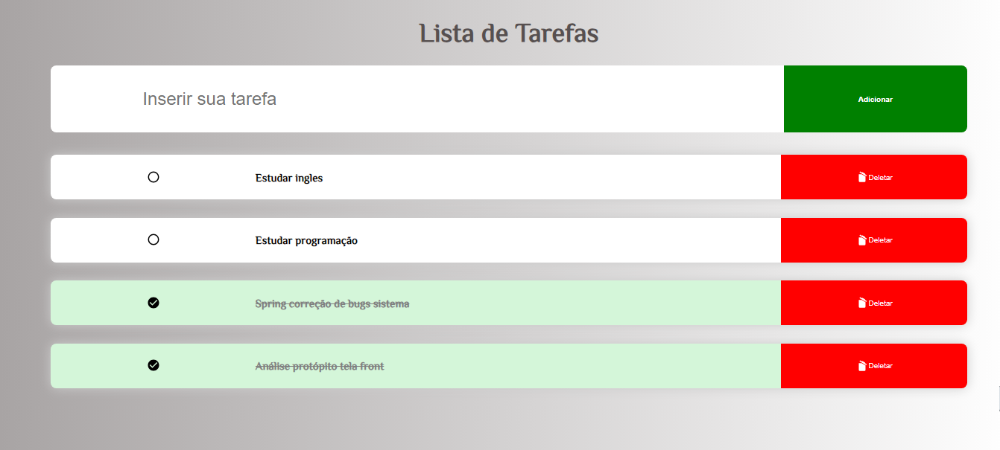

# Djh0w Lista de Tarefas

> Learning
Projeto construído aprendendo conceitos de atributos e interatividade entre o JS e HTML e CSS.

[Clique aqui para acessar](https://djh0w.github.io/lista-tarefas/)

## Tecnologias

- HTML
- CSS
- JS

## Aprendizados

Trabalhar com JS criando as interações de tela, como inserir uma nova tarefa, deletar e ordenar as tarefas concluídas.

## Contato

joao.ps.junior1989@gmail.com